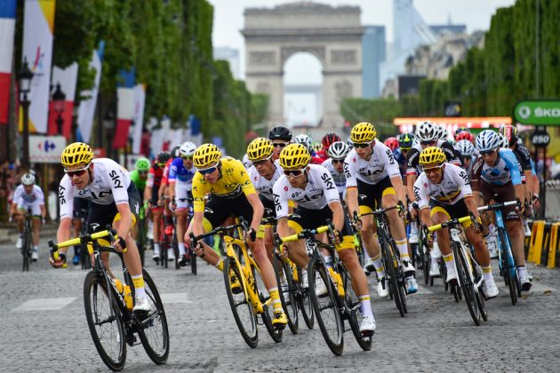

```{r setup, include=FALSE}
library(shiny)
library(flexdashboard)
library(tidyverse)
library(plotly)

top_tens <- as.tibble(readRDS("top_tens.rds"))
doping_tibble <- as.tibble(readRDS("doping_tibble.rds"))
tour_data <- as.tibble(readRDS("tour_data.rds"))
mergedtop_tens<- as.tibble(readRDS("mergedtop_tens.rds"))

```


About
==========================
Column 
-------------------------

####Authors: 
  Lisa Fisher and Isaac Slagel

####Methodology
  To create this page we scraped data on the Tour de France from the sources listed below. Using R we tidied this data and created a Shiny app which allows the user to interact with our data. If your interested in what is going on under the hood, please follow the link to our source code in the top right corner of the window.
  
  The goal of our project was to learn about how the Tour de France, how the race has changed overtime, and how doping has played a role towards the front of the race. 
  
  We hope that you enjoy this project as much as we enjoyed making it!

####Sources 
- Tour De France [Winners](https://en.wikipedia.org/wiki/List_of_Tour_de_France_general_classification_winners)

- Tour De France [Stage Wins per Rider](https://en.wikipedia.org/wiki/Tour_de_France_records_and_statistics#Stage_wins_per_rider)

- Athletes in the top 10 of any year after 1998 and whether they have been caught doping as well as a general [summary table](https://en.wikipedia.org/wiki/Doping_at_the_Tour_de_France).

####Packages
- shiny
- flexdashboard
- tidyverse
- plotly

Column {data-width=600}
-------------------------
 

<center>



</center>

Countries of Winners (Map)
==========================

Inputs {.sidebar}
-------------------------
```{r , echo=FALSE}
inputPanel(
  checkboxInput("doped", label = h6("Exclude Doped Winners"), FALSE),
  checkboxInput("europe", label = h6("Just Europe"), FALSE)
)
```


Column 
-------------------------
###Map

```{r , echo=FALSE}

renderPlot({ 
WorldData <- map_data('world')
WorldData %>% filter(region != "Antarctica") -> WorldData
WorldData <- fortify(WorldData)

a <-  if(input$doped){tour_data %>%
  left_join(doping_tibble, by = c("Cyclist" = "Name"))%>%
  filter(Status == "Never failed tests" | is.na(Status)) %>%
  mutate(Country = ifelse(Country=="United States", "USA", Country))%>%
  mutate(Country = ifelse(Country=="United Kingdom", "UK", Country))%>%
  group_by(Country) %>%
  count()
  } else{
    tour_data %>%
  left_join(doping_tibble, by = c("Cyclist" = "Name"))%>%
  mutate(Country = ifelse(Country=="United States", "USA", Country))%>%
  mutate(Country = ifelse(Country=="United Kingdom", "UK", Country))%>%
  mutate(Country = ifelse(Country=="United Kingdom", "UK", Country))%>%
  group_by(Country) %>%
  count()
  } 

if(input$europe){
ggplot()+
  geom_map(data=WorldData, map=WorldData,
                  aes(x=long, y=lat, group=group, map_id=region),
                  fill="white", colour="#7f7f7f", size=0.5)+
  geom_map(data=a, map=WorldData,
                  aes(fill=n, map_id=Country),
                  colour="#7f7f7f", size=0.5)+
  theme_void()+
  scale_fill_continuous(low="thistle2", high="darkred", 
                               guide="colorbar")+
  labs(fill="legend", title="", x="", y="")+
    coord_map(xlim = c(-10,20), ylim = c(35, 63))
} else {
  ggplot()+
  geom_map(data=WorldData, map=WorldData,
                  aes(x=long, y=lat, group=group, map_id=region),
                  fill="white", colour="#7f7f7f", size=0.5)+
  geom_map(data=a, map=WorldData,
                  aes(fill=n, map_id=Country),
                  colour="#7f7f7f", size=0.5)+
  theme_void()+
  scale_fill_continuous(low="thistle2", high="darkred", 
                               guide="colorbar")+
  labs(fill="legend", title="", x="", y="")+
    coord_map(xlim=c(-180,180))
}
})
```

### Description

This map provides a visual depiction of where the winners of the Tour de France are from. We found that a zoomed perspective on Europe is helpful as many of the winners hail from countries here. Additionally we created a feature to allow the user to show the world map when known dopers are excluded.  

Countries of Winners (Barplot)
==========================

Inputs {.sidebar}
-------------------------

```{r , echo=FALSE}
inputPanel(
  selectInput("b", label = h6("Countries:"), c(tour_data$Country[!is.na(tour_data$Country)]), multiple = TRUE, selected = c("United States", "France")),
  checkboxInput("doped2", label = h6("Fill by Known Doping Status"), FALSE)
)
```

Column 
-------------------------
### Countries of Winners: 1903-2018

```{r, echo = FALSE}

renderPlot({


tour_data2 <- tour_data %>%
  left_join(doping_tibble, by = c("Cyclist" = "Name"))%>%
    filter(Country %in% input$b)


if(input$doped2){
tour_data2 %>%
    mutate(Clean = ifelse(tour_data2$Status == "Never failed tests" | is.na(Status), "Not Proven Doped", "Doped")) %>%
    ggplot(mapping = aes(x = Country, fill = Clean )) +
    geom_bar(stat = "count") +
    ylim(0,40) +
    labs(fill = "Status") +
    theme(legend.box.background = element_rect(colour = "black"))
}else {
tour_data2 %>%
    mutate(Clean = ifelse(tour_data2$Status == "Never failed tests" | is.na(Status), "Not Proven Doped", "Doped")) %>%
    ggplot(mapping = aes(x = Country)) +
    geom_bar(stat = "count") +
    ylim(0,40) +
    labs(fill = "Status") +
    theme(legend.box.background = element_rect(colour = "black"))
}
})

```

### Description
  
  This barplot provides another visualization of the number of winners any given country has had in the Tour de France. This plot also allows us to differentiate by doping status. 


When looking comparing all countries who have had winners we see that France has had the greatest overall success, but they have also have the greatest number of doped athletes. Belgium follows France with the second largest number of wins, but also has had some doped athletes. Countries who have had winners who have doped include: France, Belgium, Spain, Italy, the U.S., and the Netherlands.


For countries outside of Europe, the U.S. has had the most success but over half of their wins have been from doped riders (6 of which were Lance Armstrong). Australia is the only other country outside of Europe that has had a cyclist win the Tour de France.


It is important to note that a single athlete, doped or not doped, can win the Tour de France multiple years. This means that within a single country such as the U.S., only two riders, Greg Lemond and Lance Armstrong, have contributed to the 10 wins for the country. With Armstrong's doped status, the barplot shows 6 of the wins as doped wins and 4 as clean wins. Other countries also have cyclists, both doped and not doped, that have won more than one year of the Tour de France, and this should be considered in your analysis.


Doping in Top Finishers
===========================


Inputs {.sidebar}
-------------------------------------


```{r}
mergedtop_tens2 <- mergedtop_tens %>%
  mutate(Notes2 = ifelse(Notes2 == "Admitted to doping without failed tests or sanction for the current race.", "Admitted, No Failed Tests", Notes2)) %>%
  mutate(Notes2 = ifelse(Notes2 == "Accused of doping without failed tests, sanction or admittance in their career.", "Accused, No Failed Tests", Notes2)) %>%
  mutate(Notes2 = ifelse(Notes2 == "Has never been: stripped of a title, failed tests or sanctioned for doping to date, with no known accusations.", "Clean", Notes2)) %>%
  mutate(Notes2 = ifelse(Notes2 == "Stripped of title in the current race due to doping.", "Stripped of Title", Notes2)) %>%
  mutate(Notes2 = ifelse(Notes2 == "Failed tests for doping in another competition or out of competition at some point in their career.", "Failed Tests at Some Point", Notes2)) %>%
  mutate(Notes2 = ifelse(Notes2 == "Sanctioned for doping without failed tests at some point in their career.", "Sanctioned for Doping, No Failed Tests", Notes2))
```


```{r, echo = FALSE}
inputPanel(checkboxGroupInput("x", label = h3("Fill Variable"),
    choices = c("Stripped of Title" = "Stripped of Title",
                "Failed Tests at Some Point" = "Failed Tests at Some Point",
                "Sanctioned for Doping, No Failed Tests" = "Sanctioned for Doping, No Failed Tests",
                "Admitted, No Failed Tests" = "Admitted, No Failed Tests",
                "Accused, No Failed Tests" = "Accused, No Failed Tests",
                "Clean" = "Clean"), 
    selected = "Stripped of title")
)

```


Column 1
-------------------------------------
###Categories of Doping in the Top Ten Finishers: 1998-2015


```{r, echo = FALSE}
renderPlot({
  mergedtop_tens2 %>%
    filter(Notes2 %in% input$x,
           Rank != 11) %>%
    ggplot() + 
      geom_bar(mapping = aes(x = Year, fill = Notes2), 
               position = "stack", stat = "count")+
    scale_y_continuous(breaks=seq(0,10,1)) +
    coord_cartesian(ylim= c(0,10),
                    xlim = c(1998,2015)) +
    theme_bw() +
    scale_fill_brewer(palette="Set2") +
    labs(fill = "Status") +
    theme(legend.box.background = element_rect(colour = "black"))
})


```

### Description
This interactive barplot provides examples of the doping status of top finishers of the Tour de France between 1998-2015. 


In the years 1999-2010, at least one cyclist was stripped of their title within the top 10 finishers every year. 2005 was the year with the greatest number of riders in the top 10 stripped of their title, with three riders.

In all the years from 1998-2015, with the exception of 2012 and 2014, at least one athlete in the top 10 had failed doping tests at some point in their career, but not that particular race. In 2003, there were five riders in the top 10 who had failed drug tests at some point in their career.

Throughout the years, many athletes have also been sanctioned for doping without having failed tests or have admitted to doping without having failed tests. When looking at the number of clean riders in the top 10 each year, years 2011 to 2015 have had at least six or more riders who have not been proven to have doped for that particular race or in their career. 

The categories of doping include:

1. Stripped of Title, in which an athlete loses their title in the top 10 of the Tour de France due to their doped status.
2. Failed Tests at Some Point, in which an athlete failed tests for doping in another competition or out of competition at some point in their career.
3. Sanctioned for Doping, No Failed Tests, in which an athlete is sanctioned for doping without failed tests at some point in their career.
4. Admitted, No Failed Tests, in which an athlete admitted to doping without failed tests or sanction for the current race.
5. Accused, No Failed Tests, in which an athlete has been accused of doping without failed tests, sanction or admittance in their career.
6. Clean, in which an athlete has never been: stripped of a title, failed tests or sanctioned for doping to date, with no known accusations.


Interactive Table
=======================
```{r, echo = FALSE}
inputPanel(
  sliderInput("slider1", label = h3("Year"), min = 1998, 
        max = 2015, value = c(1998, 2015), sep = ""),
  textInput("text", label = h3("Key Words"), value = NULL , placeholder = "Eg. EPO")
)

renderTable({ 
top_tens %>% 
  mutate(Time = str_replace(Time, "^[^\\+](.*)", "Winner"))%>%
  mutate(Notes = ifelse(is.na(.$Notes)," ", .$Notes))%>%
  filter(Notes %in% Notes[str_detect(.$Notes, input$text)] | 
         Name %in% Name[str_detect(.$Name, input$text)] | 
         Team %in% Team[str_detect(.$Team, input$text)]) %>%
  mutate(Year = parse_integer(Year)) %>%
  filter(Rank <= 10) %>%
  filter(Year >= input$slider1[1], Year <= input$slider1[2])
}) 

```


What does it take to win? 
=========================
```{r, include=FALSE}
a <- tour_data %>%
  mutate(Margin = str_remove(Margin, "\\+ ")) %>%
  separate(Margin, into = c("mHour", "mMin", "mSec" ), sep = " ", fill = "left") %>%
  mutate(mHour = parse_number(mHour),
         mMin = parse_number(mMin)/60,
         mSec = parse_number(mSec)/3600) %>%
  mutate(Margin = rowSums(cbind(.$mHour, .$mMin, .$mSec) , na.rm = TRUE)) %>%
  mutate(Year = parse_number(Year))%>%
  mutate(Margin = Margin*60)%>%
  select(Year:`Time/Points`, Margin, `Stage wins`:`Stages in lead`)
```

Inputs {.sidebar}
-------------------------------------


```{r, echo=FALSE}
inputPanel(
  selectInput("select", label = h3("Comparison"), 
    choices = list("Margin of Win" = 1, "Stage Wins" = 2, "Stages in Lead" = 3), 
    selected = 1), 
  sliderInput("slider2", label = h3("Year"), min = 1900, 
        max = 2018, value = c(1900, 2018), sep = "")
)
```

Column
-------------------------------------
### Characteristic of Winners

```{r, echo=FALSE}
renderPlotly(
if(input$select == 1) {
  a %>% 
  filter(Year < 1905 | Year >1914) %>%
  filter(Year >= input$slider2[1], Year <= input$slider2[2]) %>%
  filter(Margin !=0 ) %>%
  ggplot(aes(x=Year, y=Margin))+
  geom_point()+
  geom_smooth()+
  geom_text(x = 1910, y = 70, label = "Data not reliable / WWI", size = 1.9) +
  geom_text(x = 1943, y = 20, label = "WWII", size = 1.9) 
}else if(input$select == 2){
a %>% 
  filter(Year >= input$slider2[1], Year <= input$slider2[2]) %>%
  filter(!is.na(`Stage wins`))%>%
  mutate(`Stage wins`=parse_integer(`Stage wins`))%>%
  ggplot()+
  geom_bar(aes(x=`Stage wins`))+
  xlim(0,8)
}else if(input$select == 3){
a %>%
  filter(Year >= input$slider2[1], Year <= input$slider2[2]) %>%
  filter(!is.na(`Stages in lead`)) %>%
  ggplot()+
  geom_bar(aes(x=parse_integer(`Stages in lead`)))+
  labs(x = "Stages in the Lead")+
  xlim(0,22)
})


```

### Description
These charts provide a few metrics to be compared between winners of the Tour de France.

We see that overtime the margin for the winner has shrunk. The race has gotten tighter. However, we see that these decreases in margin mostly occurred between 1900 and 1960. Since 1960, the margin of the winner has stayed under 15 minutes. 

The Tour de France is raced in many 1 day races or stages. Generally there are 21 stages but in older races this isn't always true. Interestingly enough, we see that the general classification winner (the rider with the lowest aggregate time) rarely wins more than 5 stages. The mode amount of stages won by the winner is 2. 

Stages in the lead refers to how many days a rider was leading in aggregate time (aka the general classification leader). We see that it is much more common for riders to be in the lead for many of the stages. Amazingly enough we see that riders have managed to pull off the win with as few 1 stage led or as many as 21 stages led. That is quite the range!
